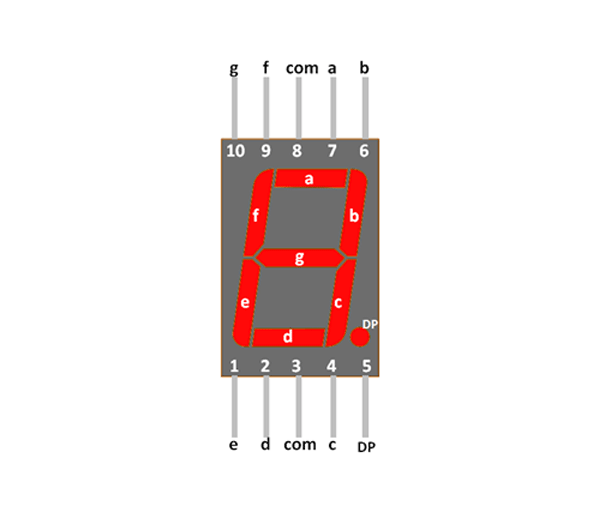

# Secret Code

To gain access to the tomb containing the relic, you must find a way to open the door. While scanning the surrounding area for any unusual signals, you come across a device that appears to be a fusion of various alien technologies. However, the device is broken into two pieces and you are unable to see the secret code displayed on it. The device is transmitting a new character every second and you must decipher the transmitted signals in order to retrieve the code and gain entry to the tomb.

## Writeup

If we open the **RA_CA_2023_6-job.gbrjob** with **KiCad Gerber View** program, we can see the board project used to send the signal:


The component on the middle of the board is a **seven segment display**.

The **datasheet** of a classic seven segment display is this:



So we can use this scheme to decode the signal:

```
g -> channel 3
f -> channel 7
a -> channel 2
b -> channel 5
e -> channel 6
d -> channel 0
c -> channel 4
DP -> channel 1
```

So, now we can able to decode the signal in this string:

```
4854427b70307733325F63306d33355F6632306d5F77313768316E4021237d
```

If we decode it from **hex**, we get the flag:

```
HTB{p0w32_c0m35_f20m_w17h1n@!#}
```