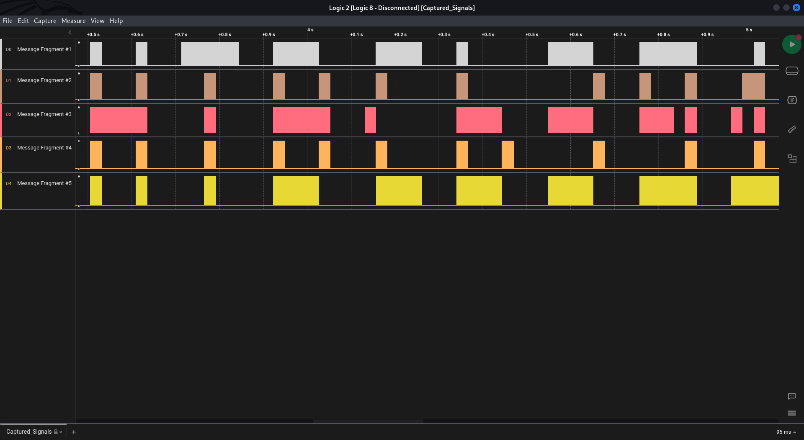

# Timed Transmission

As part of your initialization sequence, your team loaded various tools into your system, but you still need to learn how to use them effectively. They have tasked you with the challenge of finding the appropriate tool to open a file containing strange serial signals. Can you rise to the challenge and find the right tool?

## Writeup

To solve this challenge use the **Logic2** program to open the given file **.sal**.

Now just zoom in to the signal to see the flag:



The flag is:

```
HTB{b391N_tH3_HArdWAr3_QU3St}
```